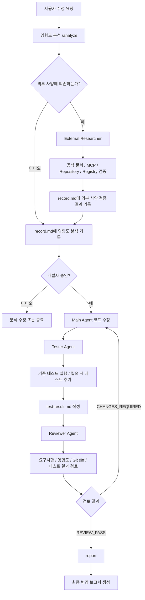

# Cursor Legacy Maintenance Harness

Cursor Agent를 이용해 레거시 코드 변경을 **분석 → 승인 → 구현 → 테스트 → 리뷰 → 보고** 순서로 통제하기 위한 경량 유지보수 하네스입니다.

단순히 AI에게 코드를 수정하도록 맡기는 대신, 변경 전 영향도를 먼저 확인하고 개발자 승인을 받은 뒤 구현하도록 강제합니다. 구현 후에는 Tester와 Reviewer를 분리해 실행 기반 검증과 독립 검토를 수행합니다. 외부 라이브러리·API·Docker·인프라 설정처럼 프로젝트 밖의 사실이 필요한 작업은 External Researcher가 공식 근거를 우선해 검증합니다.

## 개요

이 하네스의 목적은 다음과 같습니다.

- AI가 변경 범위를 충분히 확인하지 않고 바로 코드를 수정하는 것을 방지
- 변경 전 영향도와 위험 요소를 개발자가 먼저 검토할 수 있도록 지원
- 외부 제품·라이브러리 설정을 모델의 기억만으로 추측하지 않도록 제한
- 구현과 테스트, 리뷰의 책임을 분리해 자기검증 편향을 줄임
- 실제 Git 변경과 테스트·리뷰 결과를 바탕으로 변경 보고서를 생성
- 비밀번호, 토큰, 인증서 등 민감정보를 AI가 읽거나 출력하지 않도록 제한

## 주요 기능

### 1. 변경 전 영향도 분석

`/analyze` 명령은 수정 요청과 관련된 `src/` 코드를 직접 확인하고 다음 내용을 `record.md`에 기록합니다.

- 변경 대상
- 직접 영향 범위
- 추가 확인 대상
- 위험 요소
- 예상 변경 파일
- 확인된 근거와 추정 정보 구분

분석이 끝나면 코드를 수정하지 않고 개발자 승인을 기다립니다.

### 2. 명시적 승인 후 수정

Main Agent는 다음과 같이 수정 의사가 명확한 표현을 받은 경우에만 구현을 진행합니다.

- `진행`
- `수정 진행`
- `수정해`
- `수정해줘`
- `적용해줘`
- `OK`

`확인해`처럼 조회나 분석으로 해석될 수 있는 표현은 수정 승인으로 간주하지 않습니다.

### 3. External Researcher

외부 사양에 의존하는 작업에서만 조건부로 실행됩니다.

대상 예시:

- 외부 라이브러리 및 프레임워크
- SDK / REST API / OpenAPI
- Maven / Gradle dependency
- Docker image / Docker Compose
- MinIO, Redis, MySQL 등 외부 인프라
- 환경변수 키, CLI 옵션
- 버전별 설정 및 Deprecated 여부

검증 우선순위는 다음과 같습니다.

1. 현재 환경에서 실제 사용 가능한 문서 MCP
2. 공식 Documentation
3. 공식 Repository / Release Notes
4. 공식 Registry
5. 기타 신뢰 가능한 기술 자료

MCP가 없거나 필요한 정보를 제공하지 못하면 공식 자료로 fallback하며, 확인하지 못한 값은 추측하지 않습니다.

### 4. Tester Agent

Main Agent의 구현이 끝난 뒤 Reviewer보다 먼저 실행됩니다.

- 변경과 관련된 기존 `src/test/**` 테스트 탐색
- 기존 테스트 우선 실행
- 필요한 경우 `src/test/**`에 테스트 추가
- 정상 / 예외 / 경계값 / 회귀 관점 검토
- 실제 프로젝트의 Maven 또는 Gradle 구성 확인 후 테스트 실행
- 실행하지 않은 항목은 `PASS`로 처리하지 않음

Tester는 `src/main/**`을 수정하지 않습니다.

결과는 다음 파일에 기록됩니다.

```text
harness/records/<작업>/test-result.md
```

### 5. Reviewer Agent

Tester 완료 후 순차적으로 실행되며, 구현 코드를 직접 수정하지 않고 변경사항을 독립적으로 검토합니다.

주요 검토 항목:

- 요구사항과 실제 변경 내용의 일치 여부
- 사전 영향도 분석의 반영 여부
- 기존 동작 및 예외 처리 누락 여부
- 예상하지 못한 사이드 이펙트
- 기존 기능 회귀 가능성
- 테스트 범위의 적절성
- 추가 테스트 필요 영역
- 요구사항과 무관한 변경
- External Researcher 결과와 실제 구현의 일치 여부

결과는 다음 파일에 기록됩니다.

```text
harness/records/<작업>/review.md
```

Reviewer가 `CHANGES_REQUIRED`를 반환하면 Main Agent가 다시 수정하고 Tester → Reviewer 순서로 재검증합니다.

### 6. 변경 보고서 생성

`/report`는 다음 자료만 근거로 최종 보고서를 작성합니다.

- `record.md`
- 실제 Git 변경
- `test-result.md`
- `review.md`

보고서에는 다음 항목이 포함됩니다.

- 최초 수정 요청
- 영향도 분석 결과
- 실제 변경 파일
- 변경 내용 요약
- 테스트 실행 결과
- Tester가 추가한 테스트
- Reviewer 검토 결과
- 남아 있는 위험 요소
- 추가 확인 필요 사항

## 로직 순서도



## 디렉터리 구조

```text
.cursor/
├─ agents/
│  ├─ external-researcher.md
│  ├─ reviewer.md
│  └─ tester.md
├─ commands/
│  ├─ analyze.md
│  └─ report.md
└─ rules/
   └─ harness-core.mdc
```

작업 실행 시 다음과 같은 기록 구조를 사용합니다.

```text
harness/
└─ records/
   └─ <YYYY-MM-DD-작업명>/
      ├─ record.md
      ├─ test-result.md
      ├─ review.md
      └─ report.md
```

`harness/templates/record.md`가 존재하면 해당 템플릿을 사용하며, 없으면 `/analyze`에 정의된 기본 구역으로 `record.md`를 생성합니다.

## 각 파일의 역할

| 파일 | 역할 |
|---|---|
| `.cursor/rules/harness-core.mdc` | 전체 유지보수 작업에 적용되는 공통 정책과 실행 순서 정의 |
| `.cursor/commands/analyze.md` | 변경 전 영향도 분석 및 승인 대기 |
| `.cursor/commands/report.md` | Git 변경, 테스트, 리뷰 결과를 종합한 최종 보고서 생성 |
| `.cursor/agents/external-researcher.md` | 외부 라이브러리·API·인프라 사양을 공식 근거로 검증 |
| `.cursor/agents/tester.md` | 기존 테스트 실행 및 필요한 테스트 코드 보완 |
| `.cursor/agents/reviewer.md` | 요구사항·영향도·실제 변경·테스트 결과를 독립적으로 검토 |

## 사용 예시

### 1. 분석 요청

```text
/analyze 사용자 조회 API의 null 처리 방식을 수정해줘
```

Agent는 관련 코드를 분석해 `record.md`를 작성한 뒤 개발자 승인을 기다립니다.

### 2. 수정 승인

```text
진행
```

Main Agent가 승인된 변경 계획 범위 안에서 코드를 수정합니다.

### 3. 자동 검증 흐름

구현 후 다음 순서로 진행됩니다.

```text
Main Agent
  ↓
Tester
  ↓
Reviewer
```

Reviewer가 수정 필요 사항을 발견하면 Main Agent로 돌아가 재수정 후 다시 테스트와 리뷰를 수행합니다.

### 4. 보고서 생성

```text
/report
```

실제 Git 변경과 작업 기록을 바탕으로 최종 보고서를 작성합니다.

## 안전 장치

하네스에는 다음 제한이 포함되어 있습니다.

- 승인 전 `src/main/**` 수정 금지
- `.env`, `.env.*`, `application-local.yml`, `*.pem`, `*.key`, `credentials.json` 읽기 금지
- 실제 환경변수 값 조회 금지
- `git add`, `commit`, `push`, `reset`, `checkout`, `stash` 등 Git 상태 변경 금지
- DB `INSERT`, `UPDATE`, `DELETE`, DDL 실행 금지
- 실행하지 않은 테스트를 `PASS`로 기록하는 행위 금지
- Git 조회에서 확인되지 않은 파일을 실제 변경으로 보고하는 행위 금지

## 근거 표기

분석 결과는 다음 규칙으로 근거 수준을 구분합니다.

```text
[확인] 경로  → 실제 파일을 열어 확인한 내용
[추정]       → 파일을 직접 확인하지 않고 이름이나 정황으로 판단한 내용
```

이를 통해 모델의 추론과 실제 코드 확인 결과를 구분합니다.

## 적용 범위 및 제약

현재 하네스는 `src/` 중심의 레거시 애플리케이션 유지보수를 대상으로 합니다.

- `build.gradle`, `Dockerfile`, `.github/` 등 `src/` 밖의 변경은 별도 확인 후 진행합니다.
- Agent별 `model` 값은 Cursor에서 실제 사용 가능한 모델 ID에 따라 조정이 필요할 수 있습니다.
- External Researcher의 MCP 사용 여부는 현재 Cursor 환경에 연결된 MCP에 따라 달라집니다.
- 테스트 실행 가능 여부는 프로젝트의 빌드 환경과 외부 의존성 상태에 영향을 받습니다.
